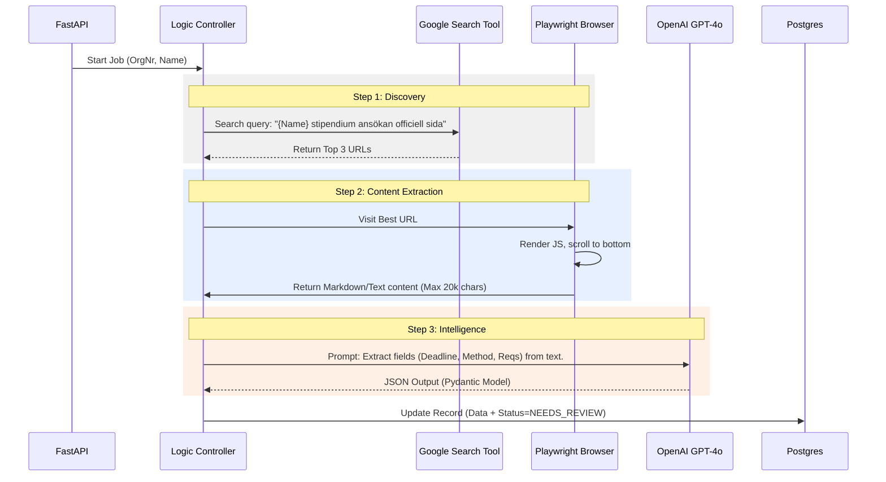

```markdown
# Specification: Data Engine Service

## 1. Overview
The Data Engine is a Python/FastAPI service responsible for the "Enrichment Pipeline". It does not handle user traffic. Its sole purpose is to find, clean, and structure scholarship data.

## 2. API Endpoints (Internal)

These endpoints are consumed by the **Admin Frontend**.

* `GET /scholarships/queue`
    * Returns list of scholarships with `status=NEW` or `FAILED`.
* `POST /scholarships/{id}/trigger-scrape`
    * Starts an async background task to process a specific scholarship.
* `GET /scholarships/{id}/review`
    * Returns the AI-extracted data alongside the raw scraped text for manual comparison.
* `PATCH /scholarships/{id}/approve`
    * Admin validates data. Updates status to `PUBLISHED` and generates the Vector Embedding.

## 3. The Scraping Pipeline (Logic Flow)

The agent must follow this strict sequence using **LangChain** (or similar orchestration) and **Playwright**.


```